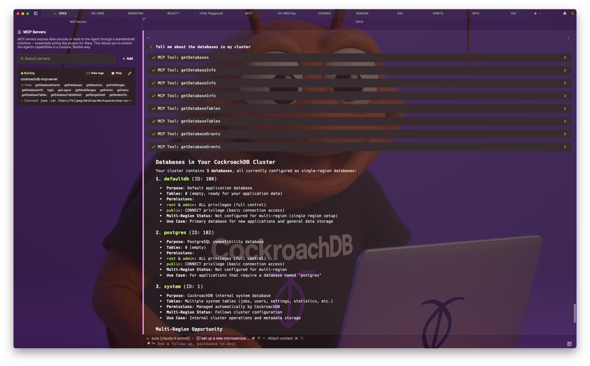

# MCP Server for CockroachDB

This is an implementation of the MCP (Multi-Cluster Protocol) server for CockroachDB, enabling seamless communication and data sharing across multiple CockroachDB clusters. It uses the CockroachDB's API to get information about the cluster.

## Development

This is a Spring Boot Project that uses Spring AI to create an MCP Server for CockroachDB. This is built using the Groovy Programming Language.

### Requirements

- Java 17 or higher
- https://jqlang.org/[jq^] 
- Docker (for running CockroachDB cluster - 3 nodes)

### Setup

You need to have Docker and Docker Compose installed on your machine and have CockroachDB running with minimum of 3 nodes.

1. Clone this repository.
2. Build and generate the mcp-server JAR using Gradle.
+
[source,shell]
----
./gradlew bootJar
----

#### Docker / Docker Compose

Use the `docker` folder from this repository. Here you have some useful scripts and the `docker-compose.yaml` that has all what you need.

1. Run the `./setup.sh` to create the certificates.
2. Run `docker-compose up` or `docker compose up`
3. In another terminal, initialize the cluster with `docker-compose exec roach1 cockroach init --certs-dir=/certs`, or `docker compose exec roach1 cockroach init --certs-dir=/certs` or `docker exec -it roach1 cockroach init --certs-dir=/certs`
4. Connect  to a SQL session with: `docker exec -it roach1 cockroach sql --certs-dir=/certs --host=localhost:26257`
5. Alter the root password with `ALTER USER root WITH PASSWORD 'password';`, then you can use the https://localhost:8080.
6. You can quit with `exit`.

*Vewrify your CockroachDB Cluster works*

1. Get the Session Coockie with
+
[source,shell]
----
export SESSION=$(curl -s --cacert certs/ca.crt \
--cert certs/client.root.crt \
--key certs/client.root.key \
-X POST -d 'username=root&password=password' \
-H 'Content-Type: application/x-www-form-urlencoded' \
https://localhost:8080/api/v2/login/ | jq -r .session)
----

2. Verify you have access to the API by use the `/api/v2/nodes` endpoint with:
+
[source,shell]
----
 curl -s --cacert certs/ca.crt \
 --cert certs/client.root.crt \
 --key certs/client.root.key \
 -H "X-Cockroach-API-Session: ${SESSION}" \
 https://localhost:8080/api/v2/nodes/ | jq .
----

If everything went well, you should have the `nodes` information.

## Usage

I'm using this MCP server in the https://www.warp.dev/[WARP Terminal^] to manage multiple CockroachDB clusters efficiently. The configuration I used was:

[source,json]
----
{
  "cockroachdb-mcp-server": {
    "command": "java",
    "args": [
      "-jar",
      "<path to your jar file>"
    ],
    "env": {
      "SESSION_COOKIE": "<your session cookie>",   // <1>
      "CERTS_DIR": "<certs directory>"              // <2>
    }
  }
}
----
.<1> You need the `SESSION_COOKIE` that you can get from the login process (Explained above).
.<2> You need the `CERTS_DIR` that points to the directory where your certificates are stored. It will be the full path. 

This is my actual configuration:

[source,json]
----
{
  "cockroachdb-mcp-server": {
    "command": "java",
    "args": [
      "-jar",
      "/Users/felipeg/Desktop/Workspaces/mcp-server/build/libs/mcp-server-0.0.1-SNAPSHOT.jar"
    ],
    "env": {
      "CERTS_DIR": "/Users/felipeg/Desktop/Workspaces/mcp-server/docker/certs",
      "SESSION_COOKIE": "CIGAsvXPu9+kDxIQT4DBG5eSQ3k6NVjAXNhPYw=="
    },
    "working_directory": null
  }
}
----

You need to start the https://docs.warp.dev/knowledge-and-collaboration/mcp[MCP Server^] from WARP. 

Next, you can query directly in the terminal with input such as:

- `Get all the nodes from my CockroachDB cluster`
- `Give me which node has the hot ranges`.
- `Give me the versions of my CockroachDB cluster`

*In Action*

Asking: `Tell me about the databases in my cluster`

